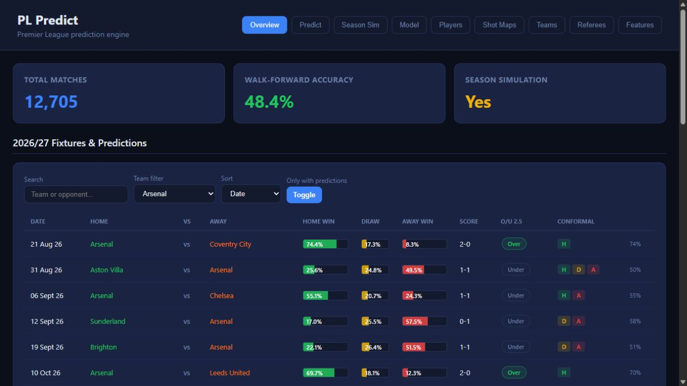
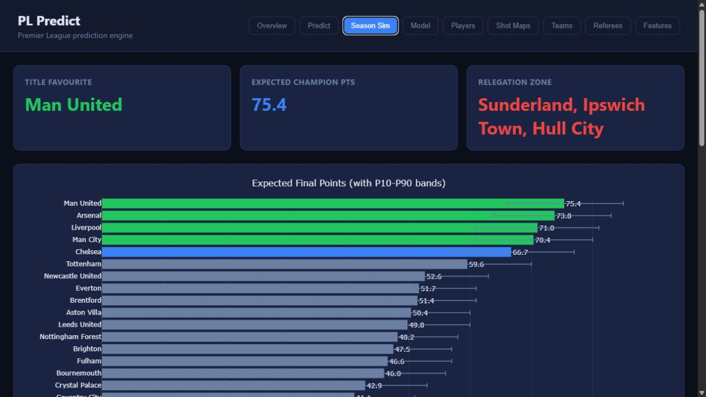
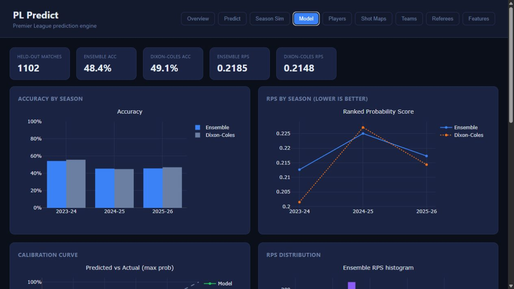

# PL Predict

> A local Premier League prediction and analytics workspace for fixtures, teams, players, season outcomes, and FPL decision support.

[](https://www.python.org/)
[](LICENSE)
[](https://site-nine-pink-18.vercel.app)

PL Predict turns open Premier League data into a complete local dashboard. Use it to forecast individual fixtures, understand expected-goals context, simulate the season table, explore player and team data, inspect model quality, and—if you play Fantasy Premier League—compare official FPL xP against an independent fixture-aware signal.

**[Open the install page →](https://site-nine-pink-18.vercel.app)** · **[Read the methodology →](docs/plan.md)**

## What you can do

| Area | Included |
| --- | --- |
| Match predictions | Home/draw/away probabilities, expected goals, likely scorelines, clean sheets, BTTS and goal totals |
| Season simulator | Monte Carlo final-table projections, title, top-four and relegation probabilities |
| Team & player analysis | Form, xG/xA, shot maps, historical matches, attendance and referee trends |
| Model diagnostics | Walk-forward accuracy, ranked probability score, calibration and feature importance |
| FPL Picks | Official FPL xP, availability and fixtures plus PL Predict's fixture-level model contribution |

## See the dashboard

| Fixture forecasts | Season simulation |
| --- | --- |
|  |  |

| Model evaluation |
| --- |
|  |

## Packaged data snapshot

The included model/data snapshot contains **12,705 Premier League matches** across **33 seasons (1993–94 to 2025–26)** and **51 teams**. The current chronological holdout has **1,102 matches**; the packaged ensemble records **48.4% accuracy** and a **0.2185 Ranked Probability Score** on that holdout. Lower RPS is better.

These figures are a transparent snapshot of the shipped artifacts—not a promise of future performance. Use the dashboard’s Model view and `pl-predict evaluate --ensemble` to inspect results after updating or retraining.

## Install on Windows

Open PowerShell and run this one command:

```powershell
irm https://raw.githubusercontent.com/kianjindal2010/pl-predict/main/scripts/install.ps1 | iex
```

Then open a **new** PowerShell or Command Prompt window and start the app from anywhere:

```powershell
pl-predict
```

The dashboard opens locally at `http://127.0.0.1:8000`. Each launch refreshes official FPL data for the optional FPL Picks view, recalculates Hybrid xP for the closest upcoming gameweek, then starts the complete Premier League dashboard. It does not silently retrain the historical match model.

The installer uses Winget to add Git and Python 3.12 when needed, installs only under `%LOCALAPPDATA%\PLPredict`, and preserves local runtime data on reinstall. Run the same command again to update the application.

## From source

```bash
git clone https://github.com/kianjindal2010/pl-predict.git
cd pl-predict
python -m venv .venv
.venv\Scripts\activate
pip install -e .
pl-predict
```

### Useful commands

```bash
# Forecast one fixture
pl-predict predict "Liverpool" "Manchester City"

# Run the complete local dashboard
pl-predict

# Refresh only the FPL data and Hybrid xP cache
pl-predict refresh-fpl

# Build the historical data pipeline and train the deployable ensemble
pl-predict scrape
pl-predict train

# Simulate a season
pl-predict season --simulations 5000 --season 2025-26

# Evaluate the ensemble on the chronological holdout
pl-predict evaluate --ensemble
```

## Dashboard

The dashboard is deliberately local: model files, runtime snapshots and analytics stay on your computer. The Vercel site is only the public installer and project page.

| View | Purpose |
| --- | --- |
| Overview | Upcoming fixture probabilities and score outlook |
| Predict | Detailed fixture forecast with score matrix and model breakdown |
| Season Sim | Projected final table and outcome probabilities |
| Model | Accuracy, RPS, calibration and feature diagnostics |
| Players, Teams, Shot Maps, Referees | League-wide analysis tools |
| FPL Picks | Separate official FPL xP, PL Predict model xP and 55/45 Hybrid xP |

## Data and methodology

The project uses free/open sources including FBref, Understat, Football-Data.co.uk, Club Elo, Open-Meteo and SoFIFA. See the [architecture and methodology](docs/plan.md) for data flow, features and modelling notes.

FPL is a feature of the app, not its entire scope. The FPL view uses official FPL player, availability, event and fixture data, and keeps official xP distinct from the PL Predict contribution.

## Project layout

```text
src/pl_predict/       Application, models, pipeline, simulation and dashboard
data/                 Packaged model/data assets plus local runtime caches
tests/                Regression tests
scripts/              Data, training and diagnostic utilities
docs/                 Methodology and project notes
site/                 Static Vercel install page
```

## Contributing

Bug reports and focused improvements are welcome. Please open an issue describing the problem, keep pull requests scoped, and run the checks before opening one:

```bash
ruff format --check .
ruff check .
python -m pytest -q
```

## License

Released under the [MIT License](LICENSE). PL Predict is an independent project and is not affiliated with the Premier League or Fantasy Premier League.
